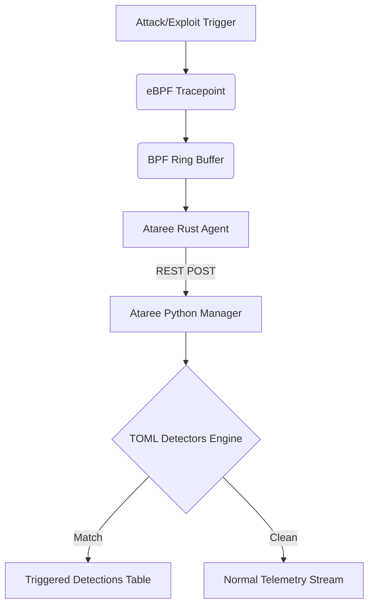

\newpage


# Introduction & Core Overview


\begin{figure}[h]
\centering
\vspace{5cm}
\caption{Illustration mapping the logical boundary of the Introduction & Core Overview implementation.}
\end{figure}


**Ataree** is a Linux runtime security project built using eBPF, combining the robustness of the KShield telemetry manager and agent with modern documentation and UI methodologies.

It observes kernel activity in real time and streams structured events securely to an IPS Control Plane (Manager) for inspection, filtering, analysis, and active enforcement via LSM hooks.

## Overview

At its core, Ataree uses:

- **eBPF Agent (Rust)**: BPF programs tracing `sys_enter_*`, `esp_input`, and other core kernel tracepoints, effectively mapping raw kernel state to telemetry structures.
- **Python Manager**: A fast backend server ingesting streams of telemetry over a REST API and correlating them with runtime `.toml` detectors.
- **LSM Enforcement**: Actively blocking unauthorized file writes, network hooks, and `ptrace` manipulations without incurring context-switching overhead.
- **Dashboard**: A gorgeous, glassmorphic frontend UI pulling metrics securely via REST.

## Core Features

- **Novel 0-Day Detection**: Accurately intercepting explicit mechanisms such as CVE-2026-43284 IPsSec ESP UDP fast-paths and CVE-2026-46333 `pidfd_getfd` exploit attempts.
- **Extensible Detection**: Add new logic via `manager/detectors/*.toml` files that are automatically synchronized to the kernel and manager state; zero compilation required. 
- **Beautiful UX**: A fully modern, beautifully orchestrated, natively responsive dark mode display for Security Operators.

!!! tip "Quick Start"
    Check out the **[API Reference](api-reference.md)** to script against the manager, or read the **[Extensibility Guide](extensibility.md)** to add your very own kernel rules!


\clearpage


# System Architecture


\begin{figure}[h]
\centering
\vspace{5cm}
\caption{Illustration mapping the logical boundary of the System Architecture implementation.}
\end{figure}


## Manager

- Runtime: Python `http.server` (`manager/app.py`)
- Storage: SQLite (`manager/data/siem.db`)
- Detector loading: TOML definitions from `manager/detectors/`
- Detector authoring guide: [detectors.md](detectors.md)
- Dashboard: static HTML/CSS/JS in `manager/static`
- APIs:
  - `POST /api/v1/agents/register`
  - `GET /api/v1/agents`
  - `POST /api/v1/events`
  - `GET /api/v1/events`
  - `GET /api/v1/detections`
  - `GET /api/v1/detectors`
  - `GET /api/v1/metrics/summary`
  - `GET /api/v1/policy`
  - `GET /api/v1/policy/<agent_id>`
  - `POST /api/v1/policy/blocked-ipv4`
  - `DELETE /api/v1/policy/blocked-ipv4`
  - `POST /api/v1/policy/blocked-bind-port`
  - `DELETE /api/v1/policy/blocked-bind-port`

## Agent

- Runtime: Rust (`agent/src/main.rs`)
- Kernel programs:
  - `kprobe/__x64_sys_execve` -> execution telemetry
  - `kprobe/__x64_sys_openat` -> file access telemetry
  - `kprobe/__x64_sys_openat2` -> file access telemetry when available
  - `kprobe/__x64_sys_ptrace` -> ptrace telemetry
  - `kprobe/__x64_sys_init_module` -> module load telemetry when available
  - `kprobe/__x64_sys_finit_module` -> module load telemetry when available
  - `lsm/socket_connect` -> inline IPv4 destination blocking
  - `lsm/socket_bind` -> inline local bind-port blocking
  - `lsm/ptrace_access_check` -> inline ptrace deny policy
  - `lsm/bprm_check_security` -> inline selected exec-path blocking
  - `lsm/file_permission` -> inline protected write-target blocking
- Maps:
  - `EVENTS` (ringbuf): kernel -> userspace events
  - `BLOCKED_IPV4` (hash): userspace policy -> `socket_connect` enforcement
  - `BLOCKED_BIND_PORTS` (hash): userspace policy -> `socket_bind` enforcement
  - `BLOCKED_EXEC_PATHS` (hash): userspace policy -> `bprm_check_security` enforcement
  - `PROTECTED_WRITE_TARGETS` (hash): userspace policy -> `file_permission` enforcement
  - `DENY_PTRACE` (hash): userspace policy -> `ptrace_access_check` enforcement

## Event Flow

1. Kernel eBPF programs emit raw events to the ring buffer.
2. Agent reads ring buffer events and converts them to JSON.
3. Agent POSTs raw events to `/api/v1/events`.
4. Manager stores raw events in the `events` table.
5. Manager evaluates each event against loaded detector definitions.
6. Matching detectors produce derived detection hits in the `detections` table.
7. Dashboard renders both raw events and triggered detections.

## Policy Flow

1. Operator creates or updates policy in the dashboard.
2. Manager persists policy in SQLite.
3. Agent polls `/api/v1/policy/<agent_id>`.
4. Agent rewrites the relevant eBPF policy maps.
5. LSM hooks return `-EPERM` for blocked actions.
6. The same LSM hooks still emit ring-buffer events so policy hits are visible in the UI and can trigger detectors.

## Detector Flow

1. Operator or developer adds a TOML detector under `manager/detectors/`.
2. Manager reloads detector definitions when the directory contents change.
3. Incoming events are evaluated against detector match criteria such as:
   - `event_types`
   - `actions`
   - `comm_in`
   - `subject_prefixes`
   - `subject_contains`
   - `dst_ports`
   - `dst_ips`
   - `arg0_in`
   - `arg1_in`
4. Matching events create persisted detection hits.
5. Dashboard shows detector hit volume, hit details, and per-detector hit counts.


\clearpage


# Security Dashboard & Controller API Reference


\begin{figure}[h]
\centering
\vspace{5cm}
\caption{Illustration mapping the logical boundary of the Security Dashboard & Controller API Reference implementation.}
\end{figure}


The Ataree backend manager exposes a RESTful API over HTTP to interact with agents, fetch metrics, and manage LSM enforcement policies. Below is the API reference.

> **Note on Authentication:**
> Most endpoints used by the dashboard UI require HTTP Basic Authentication (`admin:secret`), with the exception of `/healthz`, `/api/v1/agents/register`, and `/api/v1/policy/{agent_id}`.

---

## Agent & Event Ingestion

### `POST /api/v1/agents/register`
Registers a new eBPF agent.
- **Payload:** `{"hostname": "...", "ip": "...", "kernel": "...", "version": "..."}`
- **Returns:** `{"agent_id": "<uuid>"}`

### `POST /api/v1/events`
Submit a batch of raw telemetry events gathered by the eBPF agent from the kernel ring buffer.
- **Payload:** `{"events": [ { ... } ]}`
- **Returns:** `{"written": int}`

---

## Dashboard Data

### `GET /api/v1/metrics/summary`
Returns overarching aggregation statistics for the dashboard.
- **Returns:** Total occurrences, blocked events, severity breakdown, and loaded policy counts.

### `GET /api/v1/agents`
Returns a list of all known registered agents and their last seen statuses.

### `GET /api/v1/events`
Returns a paginated list of recent raw telemetry events.
- **Query Params:** `limit` (default: 200, max: 2000)

### `GET /api/v1/detections`
Returns a list of events that matched active TOML detectors (Triggered Detectors).
- **Query Params:** `limit` (default: 200, max: 2000)

### `GET /api/v1/detectors`
Returns all active loaded rules from the `manager/detectors/*.toml` directory, with their current live hit counts.

---

## Policy & LSM Enforcement

Policies dictating what gets blocked (IPv4s, bind ports, exec paths, file writes, ptrace) can be dynamically configured.

### `GET /api/v1/policy`
Returns all globally defined policies.

### `GET /api/v1/policy/{agent_id}`
Returns all active policies tailored to a specific agent's scope. The agents constantly poll this endpoint.

### Modifying Policies
You can add or remove policies via `POST` or `DELETE` across various sub-routes:
- `/api/v1/policy/blocked-ipv4`
- `/api/v1/policy/blocked-bind-port`
- `/api/v1/policy/blocked-exec-path`
- `/api/v1/policy/protected-write-target`
- `/api/v1/policy/deny-ptrace`

**POST Example (Block an IP):**
```json
{
  "ip": "203.0.113.10",
  "enabled": true,
  "agent_id": "" 
}
```

**DELETE Example:**
```json
{
  "ip": "203.0.113.10",
  "agent_id": "" 
}
```
*(Passing an empty `agent_id` scopes the rule globally.)*


\clearpage


# Out-of-the-Box Protection: Preloaded Detectors


\begin{figure}[h]
\centering
\vspace{5cm}
\caption{Illustration mapping the logical boundary of the Out-of-the-Box Protection: Preloaded Detectors implementation.}
\end{figure}


Here are all the out-of-the-box detectors available in Ataree:

- **Blocked Bind Port**: Highlights bind attempts denied by port policy.
- **Blocked Egress Connection**: Highlights outbound network connections blocked by policy.
- **Blocked Exec Path**: Highlights execution denied by selected exec path policy.
- **Blocked Ptrace**: Highlights ptrace access denied by policy.
- **Blocked Sensitive Write**: Highlights denied writes to protected targets.
- **BPF Syscall Use**: Flags direct bpf syscall use from userspace.
- **CVE-2026-43284 ESP-in-UDP Splice**: Flags ESP packets parsed by esp_input, catching potential exploitation of the SKBFL_SHARED_FRAG decrypt-in-place bug.
- **CVE-2026-46333 Exploitation Attempt**: Flags usage of pidfd_getfd to copy file descriptors from privileged processes, indicating the ssh-keysign-pwn race condition.
- **Interactive Shell Execution**: Flags execution of common interactive shells.
- **Kernel Module Load Attempt**: Flags runtime kernel module loading attempts.
- **Mount Activity**: Flags mount syscall activity for manual review.
- **Kernel Memory Recon**: Flags reads of /proc/kcore which often indicate kernel memory reconnaissance.
- **Ptrace Attach Attempt**: Flags ptrace activity that can indicate live process tampering or debugging.
- **Repeated Bind Denials**: Flags repeated blocked bind attempts against the same port and process.
- **Sensitive Shadow Access**: Flags access attempts against /etc/shadow.
- **Setuid To Root**: Flags attempts to change effective uid to 0.


\clearpage


# Extensibility Guide: Writing Custom Rules


\begin{figure}[h]
\centering
\vspace{5cm}
\caption{Illustration mapping the logical boundary of the Extensibility Guide: Writing Custom Rules implementation.}
\end{figure}


Ataree is designed from the ground up to be fully extensible with minimal friction. This guide illustrates how you can extend the platform to detect novel threats.

## 1. Zero-Compile Exploit Detection

Unlike traditional kernel models that require complex re-compilation targeting specific kernel headers to identify new exploits, **Ataree** allows rapid, declarative `.toml` syntax matchers.

When the agent intercepts activity (like `sys_enter_pidfd_getfd` or `esp_input`), it streams it immediately to the backend Manager pipeline.

### The Detector Pipeline



## 2. Authoring a New Detector
The Ataree manager dynamically loads `.toml` detector files from the `manager/detectors/` directory.
2. Map it to a human-readable string inside `convert_event()` (e.g., `"my_new_event"`).
3. Rebuild the agent using `bash scripts/build_agent.sh`.

---


The Unified Shield manager dynamically loads `.toml` detector files from the `manager/detectors/` directory.

### Detector Structure

You do not need to modify any code to add a detector. Simply create a file such as `my-detector.toml`:

```toml
id = "my-new-rule"
name = "My Novel Threat Detector"
description = "Flags this specific telemetry signature."
severity = "critical"
tags = ["custom", "threat"]
summary_template = "{comm} triggered the custom rule on {subject}"

[match]
event_types = ["my_new_event"]
comm_in = ["malware", "evil"]
```

### Real-Time Loading

The manager automatically synchronizes and reloads `.toml` files upon modification without downtime. Just save the file inside `manager/detectors` and watch the Dashboard for hits!


\clearpage


# Detector Engine Capabilities & Syntax


\begin{figure}[h]
\centering
\vspace{5cm}
\caption{Illustration mapping the logical boundary of the Detector Engine Capabilities & Syntax implementation.}
\end{figure}


KShield detectors are TOML files in `manager/detectors/`. They match normalized events after
the manager stores raw agent events. Adding a detector does not require rebuilding the agent.

## Quick Start

1. Create a new `*.toml` file under `manager/detectors/`.
2. Give it a unique `id`.
3. Choose match fields under `[match]`.
4. Start or refresh the manager. The manager reloads detectors when files change.
5. Generate matching telemetry and check `/api/v1/detections` or the dashboard.

Example:

```toml
id = "suspicious-shell-from-temp"
name = "Suspicious Shell From Temp"
description = "Flags shell execution where the executed path is under /tmp."
severity = "warning"
tags = ["execution", "suspicious-path"]
summary_template = "{comm} executed {subject}"

[match]
event_types = ["execve"]
comm_in = ["bash", "sh", "dash"]
subject_prefixes = ["/tmp/"]
```

## Detector Fields

Top-level fields:

- `id`: stable unique detector ID. Use lowercase words separated by `-`.
- `name`: human-readable name shown in the UI.
- `description`: short reason this detector exists.
- `severity`: `info`, `warning`, or `critical`.
- `tags`: list of strings for grouping and search.
- `summary_template`: detection summary. May reference event fields with `{field}`.
- `threshold_count`: optional count needed before emitting a detection.
- `threshold_window_secs`: optional correlation window in seconds.
- `group_by`: optional event fields used as the threshold correlation key.

Match fields under `[match]`:

- `event_types`: event names such as `execve`, `file_open`, `file_write`, `ptrace`,
  `module_load`, `socket_connect`, `socket_bind`, `setuid`, `mount`, `bpf`.
- `actions`: `observe`, `allow`, or `block`.
- `comm_in`: exact process names from `comm`.
- `comm_prefixes`: process-name prefixes.
- `subject_prefixes`: path or subject prefixes.
- `subject_contains`: substrings in `subject`.
- `dst_ports`: destination or bind ports.
- `dst_ips`: destination IPv4 addresses.
- `uids`: Linux UIDs.
- `arg0_in`: exact numeric `arg0` values.
- `arg1_in`: exact numeric `arg1` values.

All string matching is case-insensitive except `dst_ips`.

## Event Fields

Detectors can match or render these normalized fields:

- `agent_id`
- `ts`
- `event_type`
- `action`
- `severity`
- `pid`
- `uid`
- `comm`
- `dst_ip`
- `dst_port`
- `subject`
- `arg0`
- `arg1`
- `ppid`
- `ancestry`
- `process_path`
- `pid_ns`
- `mount_ns`
- `net_ns`

## Threshold Detectors

Use `threshold_count`, `threshold_window_secs`, and `group_by` when one event is too noisy.

Example:

```toml
id = "repeated-bind-denials"
name = "Repeated Bind Denials"
description = "Flags repeated blocked bind attempts against the same port and process."
severity = "critical"
tags = ["network", "ips", "threshold"]
threshold_count = 3
threshold_window_secs = 120
group_by = ["agent_id", "comm", "dst_port"]
summary_template = "{comm} hit {match_count} blocked bind attempts on port {dst_port} within 120s"

[match]
event_types = ["socket_bind"]
actions = ["block"]
```

This emits on the third matching event in the 120 second window for the same
`agent_id`, `comm`, and `dst_port`.

## Block Detectors

LSM policy blocks are normal events with `action = "block"`. Detector examples:

```toml
id = "blocked-exec-path"
name = "Blocked Exec Path"
description = "Highlights execution denied by selected exec path policy."
severity = "critical"
tags = ["execution", "ips", "lsm"]
summary_template = "{comm} was blocked from executing {subject}"

[match]
event_types = ["execve"]
actions = ["block"]
```

```toml
id = "blocked-sensitive-write"
name = "Blocked Sensitive Write"
description = "Highlights denied writes to protected targets."
severity = "critical"
tags = ["filesystem", "ips", "lsm"]
summary_template = "{comm} was blocked from writing target {subject}"

[match]
event_types = ["file_write"]
actions = ["block"]
```

## Testing

List loaded detectors:

```bash
curl -s http://127.0.0.1:8080/api/v1/detectors | jq
```

List detections:

```bash
curl -s http://127.0.0.1:8080/api/v1/detections | jq
```

Run replay tests after adding detector fixtures:

```bash
python3 -m unittest tests.test_replay
```

## Detector Limits

Current detectors are single-event or simple threshold rules. They do not yet support:

- regex
- negative matches
- complex boolean logic
- multi-stage sequence correlation
- file hash matching
- content scanning

Use agent or manager code changes for those features.


\clearpage


# Advanced Operations: Signature Antivirus with LSM


\begin{figure}[h]
\centering
\vspace{5cm}
\caption{Illustration mapping the logical boundary of the Advanced Operations: Signature Antivirus with LSM implementation.}
\end{figure}


A simple signature-based antivirus is possible in this project, but the split matters:

- eBPF LSM is good at inline enforcement: allow or deny `exec`, `open`, `write`, `ptrace`, and similar operations.
- Userspace is the right place for signature scanning: hashing files, reading file contents, parsing signature databases, and making richer verdicts.

Do not try to build a full file-content scanner inside eBPF. BPF programs are bounded, cannot freely read whole files, and are not a good place for SHA/YARA-style work. Use BPF LSM to enforce verdicts that userspace has already computed.

## Recommended Architecture

1. Agent observes file activity and execution attempts.
2. Agent or helper scanner hashes files in userspace.
3. Agent checks hashes against a local signature database.
4. Agent writes malicious verdicts into BPF maps.
5. LSM hooks block future matching execution or file access.
6. Agent forwards `malware_detected` and block events to the manager.
7. Manager stores detections and distributes signature updates.

## Enforcement Keys

Prefer stable file identity over path-only matching:

- `dev`
- `inode`
- optional `ctime` or size
- optional file hash

Path rules are useful for policy, but weak for antivirus because files can move, link, or be replaced.

Good first implementation:

- Userspace scanner computes SHA-256.
- Signature DB maps SHA-256 to malware name/severity.
- Agent keeps a userspace cache: `(dev, inode) -> verdict`.
- Agent syncs blocked `(dev, inode)` keys into an eBPF map.
- `bprm_check_security` blocks execution if `(dev, inode)` is in the malicious map.
- `file_permission` can optionally block read or write for known malicious files.

## Signature Database Shape

Start simple:

```json
{
  "version": 1,
  "updated_at": "2026-04-24T00:00:00Z",
  "hashes": [
    {
      "sha256": "0123456789abcdef...",
      "name": "EICAR-Test-File",
      "severity": "critical",
      "action": "block"
    }
  ]
}
```

Manager can serve this as a policy endpoint later, for example:

```text
GET /api/v1/signatures
```

Agent should cache the database locally so enforcement survives manager outages.

## LSM Hooks To Use

Useful hooks:

- `bprm_check_security`: best first hook for blocking malicious executable launches.
- `file_permission`: can block reads/writes after a file is known malicious.
- `inode_create`, `inode_rename`, `inode_unlink`, `file_open`: possible future hooks for cache invalidation and quarantine workflows.

Best first milestone:

1. Scan on `execve` observation or before `bprm_check_security` verdict is needed.
2. Cache clean/malicious file verdicts in userspace.
3. Block known-malicious `(dev, inode)` in `bprm_check_security`.

## Race Conditions

Pure userspace scanning has a time-of-check/time-of-use risk:

- file is scanned clean
- file content changes
- file is executed before rescan

Reduce this with:

- cache key includes `mtime`, `ctime`, and size
- invalidate cache on write events
- rescan on first execution after write
- block unknown execution until scan completes if strict mode is enabled

Strict mode is safer but can break usability if scanners are slow.

## Scanner Options

Minimal scanner:

- SHA-256 exact hash signatures
- local JSON signature DB
- verdict cache
- BPF map sync for malicious file IDs

Better scanner:

- SHA-256 plus fuzzy hashes
- YARA-compatible rules in userspace
- quarantine metadata
- allowlists for trusted paths/signers
- per-agent signature policy from manager

## Event Types To Add

Suggested manager event types:

- `malware_scan`: scan completed
- `malware_detected`: malicious signature matched
- `malware_block`: LSM blocked access to known malicious file

Useful event fields:

- `subject`: path if available
- `arg0`: signature database version or scanner verdict code
- `arg1`: file size or signature rule ID if numeric
- `process_path`: process that touched the file
- additional raw JSON fields: `sha256`, `signature_name`, `file_dev`, `file_inode`

## Practical Next Step

Build exact-hash blocking first:

1. Add a manager signature DB endpoint or local agent signature file.
2. Add agent userspace SHA-256 scanner and verdict cache.
3. Add BPF map keyed by `(dev, inode)` for malicious files.
4. Add `bprm_check_security` enforcement against that map.
5. Emit `malware_detected` and `malware_block` events.
6. Add TOML detectors for those event types.

This gives antivirus-like blocking while keeping BPF small and reliable.


\clearpage


# Future Roadmap & Extension Plan


\begin{figure}[h]
\centering
\vspace{5cm}
\caption{Illustration mapping the logical boundary of the Future Roadmap & Extension Plan implementation.}
\end{figure}


This is the next-phase plan for KShield after the detector engine and expanded LSM policy work now in the repo.

## Phase 1: Completed in This Iteration

- Add a universal detector definition format using TOML.
- Persist detector hits separately from raw events.
- Expand telemetry beyond `execve` into file access, ptrace, and module load attempts.
- Expand LSM enforcement beyond `socket_connect` into `socket_bind`.
- Surface detector hits and detector inventory in the dashboard.

## Phase 2: Kernel Telemetry Expansion

- Add process ancestry and parent PID to event payloads.
- Add `setuid`, `mount`, and `bpf` syscall visibility.
- Capture richer file metadata for sensitive paths.
- Add optional container and namespace context when available.

## Phase 3: Detector Semantics

- Support multi-event correlation windows, not just single-event matches.
- Add threshold detectors such as repeated failed binds or bursty ptrace attempts.
- Add allowlists and suppression rules per detector.
- Add detector test fixtures and offline replay of saved event streams.

## Phase 4: Enforcement

- Add executable deny rules for selected paths or hashes.
- Add sensitive-file write protection.
- Add optional ptrace deny rules.
- Add scoped policy application per agent rather than global policy only.

## Phase 5: Operations and UX

- Turn the manager into a persistent systemd service on the host.
- Add dashboard filters for detector ID, severity, and agent.
- Add event-to-detection linking in the UI.
- Add export endpoints for JSON and CSV.
- Add health and lag indicators for detector reloads and policy syncs.


\clearpage
