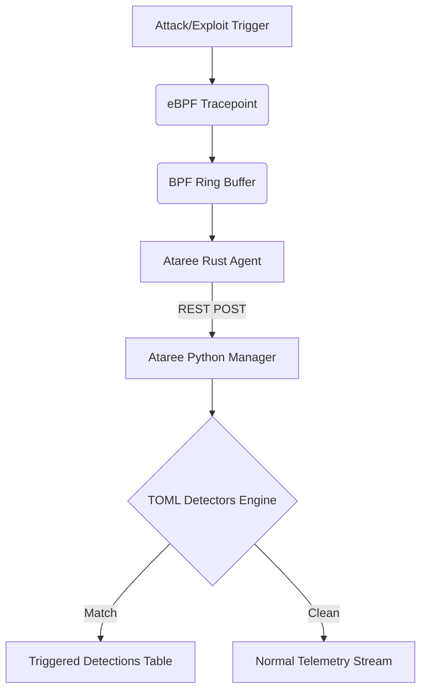

# Extensibility Guide

Ataree is designed from the ground up to be fully extensible with minimal friction. This guide illustrates how you can extend the platform to detect novel threats.

## 1. Zero-Compile Exploit Detection

Unlike traditional kernel models that require complex re-compilation targeting specific kernel headers to identify new exploits, **Ataree** allows rapid, declarative `.toml` syntax matchers.

When the agent intercepts activity (like `sys_enter_pidfd_getfd` or `esp_input`), it streams it immediately to the backend Manager pipeline.

### The Detector Pipeline



## 2. Authoring a New Detector
The Ataree manager dynamically loads `.toml` detector files from the `manager/detectors/` directory.
2. Map it to a human-readable string inside `convert_event()` (e.g., `"my_new_event"`).
3. Rebuild the agent using `bash scripts/build_agent.sh`.

---


The Unified Shield manager dynamically loads `.toml` detector files from the `manager/detectors/` directory.

### Detector Structure

You do not need to modify any code to add a detector. Simply create a file such as `my-detector.toml`:

```toml
id = "my-new-rule"
name = "My Novel Threat Detector"
description = "Flags this specific telemetry signature."
severity = "critical"
tags = ["custom", "threat"]
summary_template = "{comm} triggered the custom rule on {subject}"

[match]
event_types = ["my_new_event"]
comm_in = ["malware", "evil"]
```

### Real-Time Loading

The manager automatically synchronizes and reloads `.toml` files upon modification without downtime. Just save the file inside `manager/detectors` and watch the Dashboard for hits!
