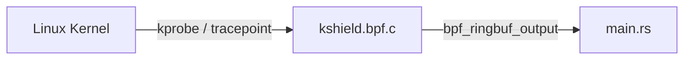

# Extensibility Guide

Unified Shield is designed from the ground up to be fully extensible with minimal friction. This guide illustrates how you can extend the platform to detect novel threats.

## 1. Modifying the eBPF Agent

The agent is responsible for executing eBPF code directly in the Linux Kernel context to capture raw telemetry. 

### Adding a New eBPF Hook

1. **Locate `kshield.bpf.c`**: Add your eBPF programs (e.g. `SEC("tracepoint/...")` or `SEC("kprobe/...")`) here.
2. **Define the Event Kind**: Provide an `EVENT_KIND_<NAME>` integer enum in `kshield.bpf.c`.
3. **Emit the Event**: Use `fill_common(&evt, EVENT_KIND_<NAME>, EVENT_ACTION_OBSERVE);` and emit with `bpf_ringbuf_output`.



### Parsing in Rust (`main.rs`)

1. Identify the new `EVENT_KIND_` in the Rust enum parsing section.
2. Map it to a human-readable string inside `convert_event()` (e.g., `"my_new_event"`).
3. Rebuild the agent using `bash scripts/build_agent.sh`.

---

## 2. Adding Manager Detectors (Rules)

The Unified Shield manager dynamically loads `.toml` detector files from the `manager/detectors/` directory.

### Detector Structure

You do not need to modify any code to add a detector. Simply create a file such as `my-detector.toml`:

```toml
id = "my-new-rule"
name = "My Novel Threat Detector"
description = "Flags this specific telemetry signature."
severity = "critical"
tags = ["custom", "threat"]
summary_template = "{comm} triggered the custom rule on {subject}"

[match]
event_types = ["my_new_event"]
comm_in = ["malware", "evil"]
```

### Real-Time Loading

The manager automatically synchronizes and reloads `.toml` files upon modification without downtime. Just save the file inside `manager/detectors` and watch the Dashboard for hits!
